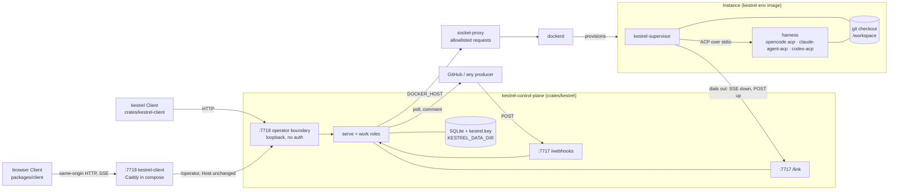

# Architecture

How kestrel's pieces fit together as the code stands. Terms are [`GLOSSARY.md`](../../GLOSSARY.md)'s;
the reasons behind each shape are in [`docs/adr/`](../adr/), cited inline. This page is the map;
each area has its own page.

| Page | Read it before you change |
| --- | --- |
| [Sessions](sessions.md) | how work is queued, claimed, executed, waits, ends or seals |
| [Link](link.md) | anything the supervisor and control plane say to each other |
| [Triggers](triggers.md) | Event ingest, matching, correlation, readiness, follow-ups, delivery |
| [Data model](data-model.md) | the schema, or a query against it |
| [Operator boundary and Client](operator-and-client.md) | an operator endpoint or a `kestrel` command |
| [Conventions](conventions.md) | anything: transactions, errors, sweeps, tests |

## Reading the ADRs

ADRs 0001–0029 predate the rename in [ADR-0030](../adr/0030-a-session-is-what-a-harness-user-calls-one.md)
and are not rewritten. Translate as you read:

| ADR 0001–0029 says | The code and `GLOSSARY.md` say |
| --- | --- |
| Run | Session |
| Session | Workspace |
| Workspace | Project |
| Agent Runtime | Harness |
| Environment (the running box) | Instance ([ADR-0017](../adr/0017-the-environment-is-declared-the-instance-is-provisioned.md)) |

A superseded ADR carries a banner naming its successor; 0001 and 0003 are superseded by 0007.

## Processes

- **Two deployables** ([ADR-0002](../adr/0002-two-deployables-the-environment-dials-out.md)): the
  `kestrel` image (control plane) and `kestrel-env` (what an Instance runs). `kestrel-dev` derives
  from `kestrel-env` with the toolchain kestrel's own development needs. See `images/*/README.md`.
- **The Instance dials out.** An Instance exposes no port; the supervisor opens the link. Nothing
  in the compute contract may assume an inbound address.
- **The Client is not a role** ([ADR-0015](../adr/0015-the-cli-is-a-client-not-a-role.md)). It holds
  no store and reaches the control plane only over the operator boundary.
- **The control plane never holds the Docker socket** ([ADR-0009](../adr/0009-the-daemon-is-reached-through-a-filtered-proxy.md)).
  `compose.yaml`'s socket-proxy regexes are the complete list of daemon requests the Docker driver
  may make; a new driver operation needs a new regex there.
- **The control plane runs no git.** Everything it knows about a checkout comes from the
  supervisor's reports or an Integration's Events ([ADR-0019](../adr/0019-kestrel-declares-the-branch-and-learns-the-pull-request.md)).

## Crates

| Crate | Binary | What it is |
| --- | --- | --- |
| `kestrel` | `kestrel-control-plane` | The control plane: store, link, operator API, triggers, dispatch. |
| `kestrel-supervisor` | `kestrel-supervisor` | Runs inside an Instance: dials the link, checks out, drives the harness as an ACP client. |
| `kestrel-client` | `kestrel` | The CLI Client. |
| `kestrel-scripted-agent` | `kestrel-scripted-agent` | A scripted ACP agent the tests drive the supervisor against. |

`packages/client` is the browser Client, a bun workspace package built into the `kestrel-client`
image and served beside the control plane on the operator interface's origin
([ADR-0043](../adr/0043-a-web-server-serves-the-browser-client.md)).

The four crates never depend on each other or form a cycle
([ADR-0050](../adr/0050-the-crate-rule-forbids-cycles-not-a-shared-leaf.md)); `kestrel-operator-types`
is a generated leaf both Rust consumers share. The two HTTP contracts are `openapi/link.json` and
`openapi/operator.json`; each side of the link defines its own types, the browser Client generates
its own from the operator document, and tests on both sides read them.

## The control plane

One binary, two **Roles** selected by argv (`crates/kestrel/src/lib.rs`). With no subcommand it runs
both in one process, the only supported topology: cross-process `Fanout` and `Timer` do not exist,
so a separate `serve` cannot wake `work`'s sweeps.

- **`serve`** (`role/serve.rs`) binds two listeners so exposing one never exposes the other: the
  link plus webhooks (`KESTREL_LISTEN`, 7717) and the operator boundary (`KESTREL_OPERATOR_LISTEN`,
  7718).
- **`work`** (`role/work.rs`) runs the timer's sweeps and the dispatch loop.

### Ports

[ADR-0005](../adr/0005-six-ports-at-rung-one-are-named-boundaries.md) names six ports. Five are
concrete modules with no trait; only `Compute` has real dispatch. Keep it that way until a second
real implementation exists ([ADR-0022](../adr/0022-store-repository-traits-and-enum-dispatch-are-deferred-to-the-postgres-rung.md)).

| Port | Module | Notes |
| --- | --- | --- |
| `Store` | `store/` | SQLite via sqlx. One repository module per aggregate, reached through `Tx`. |
| `Log` | `log.rs` | The Transcript. Same database and transaction as `Store` ([ADR-0004](../adr/0004-store-and-log-are-one-transactional-domain.md)). |
| `Fanout` | `fanout.rs` | The in-process hub a committed transaction, or a serve-role memory-only change, hands its touched resources to; only the Organization change stream subscribes. Everything else polls `Store`. |
| `Timer` | `timer.rs` | In-process sweeps; every due time lives in `Store`, so a restart loses none. |
| `Work` | `work.rs`, `scheduling.rs` | Enqueue, dispatch and explain slot requests, lease, reports, ending a Session. |
| `Compute` | `compute/` | `Driver` enum over `Docker` and `LocalExec`, chosen once by `KESTREL_COMPUTE`. |

### Modules

The rest of `crates/kestrel/src`, grouped by the page that covers them:

| Area | Modules |
| --- | --- |
| Sessions | `work.rs`, `workspace.rs`, `instance.rs`, `scheduling.rs`, `role/work.rs` |
| Link | `link/`, `provider.rs`, `profile.rs`, `keyring.rs` |
| Triggers | `trigger.rs`, `trigger/apply.rs`, `filter.rs`, `template.rs`, `cron.rs`, `readiness.rs`, `follow_up.rs`, `pull_request.rs`, `integration/` |
| Operator | `operator.rs`, `declaration.rs`, `start.rs`, `agent.rs`, `reference.rs`, `declined.rs` |
| Shared | `domain.rs` (every record type), `log.rs`, `store/`, `timer.rs`, `cli.rs`, `telemetry.rs`, `shutdown.rs`, `hex.rs`, `participant.rs` (the one rule a declared name obeys) |

## Trust boundaries

| Boundary | Who is on the other side | What protects it |
| --- | --- | --- |
| Operator (7718) | A Client | A loopback bind, plus a loopback `Host` and same-origin `Origin` check ([ADR-0036](../adr/0036-the-browser-client-shares-the-loopback-operator-origin.md), [ADR-0043](../adr/0043-a-web-server-serves-the-browser-client.md), [ADR-0044](../adr/0044-the-browser-client-is-served-over-https.md)). |
| Link (7717) | A supervisor | A per-Instance bearer credential, and a live lease for anything about a Session ([Link](link.md#authentication)). |
| Webhooks (7717) | Any producer | The Integration's HMAC signing secret or shared secret. A refusal becomes no Event; the last one is kept on the Integration. |
| Docker daemon | The control plane | socket-proxy's allowlist, on an internal network. |
| Harness | Model output and Event text | Nothing at this layer: brief content is attacker-controlled, and policy is future work. |

Secrets reach an Instance only as the harness process's environment or files under its home, for
one Session, and never in a Transcript. `KESTREL_`-prefixed variables are reserved for the
supervisor ([ADR-0026](../adr/0026-kestrel-carries-named-credentials-never-a-runtimes-store.md)).

## Where the code lags the ADRs

An accepted ADR is a decision, not a description. These are decided and not yet built:

- **Integration identity** ([ADR-0028](../adr/0028-an-integration-lends-a-run-its-identity.md)): the
  GitHub Integration authenticates as a GitHub App and mints its own installation tokens. The
  agent's `gh` still uses a token an operator supplies, and an Integration does not yet refuse to
  hear its own bot login.
- **Pull request state** ([ADR-0032](../adr/0032-a-pull-request-event-updates-workspace-state-without-a-firing.md)):
  opened, reopened, closed (including merges) and head-moved Events are learned. The Audit Record
  that explains unattended attachment verdicts remains `0.5` work.
- **Split roles**: `serve` and `work` parse separately but run correctly only in one process.
- **The first run** ([ADR-0045](../adr/0045-a-browser-tab-holds-one-stream-and-subscribes-over-requests.md)–[ADR-0049](../adr/0049-an-install-has-one-operator-and-by-default-one-organization.md)):
  the Client is still served over HTTPS with a stream per follow; there is no sign-in catalogue,
  relay, image label, Operator or default Organization, and `kestrel-env` carries opencode alone.
- **Policy, Approvals, Questions, Workflows, Campaigns** exist in `GLOSSARY.md` and
  [`ROADMAP.md`](../../ROADMAP.md), not in code. `session_dependency` and the Unreachable state are
  the only Workflow machinery built.
