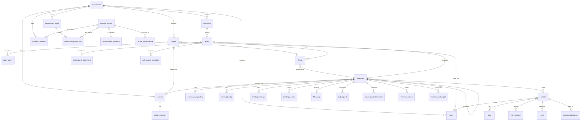

# Data model

The SQLite schema in `crates/kestrel/src/store/migrations/`. Tables are `STRICT`; timestamps are
RFC 3339 text; IDs are UUIDv7 text. Read every migration for a table's current shape: several
tables gain columns in later files.

## Relationships

`organization_id` scopes owned records and is omitted from the diagram. The Operator is install-wide.

## Tables

| Table | Holds | Notes |
| --- | --- | --- |
| `operator` | The install's person | One stable ID and a renameable label; naming authenticates nobody. |
| `organization` | The boundary | `max_live_instances` caps Instances across its Workspaces. |
| `project`, `project_repository` | Repositories and default branch | Ordered by `position`; the first is where ACP sessions are rooted. |
| `agent` | Harness and optional model | A null `model` means the harness default. |
| `provider_credential` | Organization secrets by variable name | `sealed` is encrypted with `kestrel.key`. |
| `subscription_profile`, `…_entry` | A person's harness login | `owner_operator` fixes Operator ownership separately from free-text ownership. Entries are `variable` or `file`, sealed to the Profile ID. |
| `material_revision` | One write of a credential or Profile entry | `AUTOINCREMENT`, so a write after a delete never reuses a revision. Every write mints one, generic or catalogued, and both material tables carry their current `revision`. |
| `authentication_evidence`, `model_use_evidence` | What a revision is known to do | Keyed by revision, so a late result attaches to the material it examined and never to its replacement. `provider_check` keeps a provider's status and error type, never its message. Model use is the latest result per harness and model. |
| `integration` | GitHub or generic webhook | `CHECK`s tie columns to `kind`. GitHub's `signing_secret` and its App private key (`private_key_sealed`) are both sealed; a webhook keeps `shared_secret_digest`. The poll cursor (`deliveries_read_from`, GitHub's clock), `last_polled_at` (kestrel's), `repository_id` and the last refusal live here; a refusal with no `last_event_refusal_id` is Deliveries lost to GitHub's retention. `state`, `revision` and `maintained_at` are its lifecycle: every maintenance change bumps `revision`, which fences work begun before it. |
| `event` | Every recorded CloudEvent | `integration_id` null for minted Events. |
| `trigger`, `trigger_agent` | The rule and its allowed Agents | Exactly one of `filter`, `every_ms`, `cron`. `due_at` is set only for schedules. |
| `firing` | One Trigger × one Event | `outcome` ∈ opened, fed, ignored, held, canceled, failed; `CHECK`s tie `workspace_id`, `failure` and `considered_at` to it. |
| `workspace`, `workspace_repository` | The durable place | Checkout fixed at open (`base`, `branch`, repositories). `instance`, `observed` (last git report) and `last_active_at` are current values. |
| `transcript_entry` | The Transcript | `(workspace_id, seq)`; indexed by Workspace, kind and seq. `session_id` attributes entries; `body` is a JSON `log::Entry` tagged by `type`. |
| `transcript_payload` | Transcript body fields over 64 KiB | Stored atomically with the entry; `(workspace_id, seq, field)` owns each payload. Strings are UTF-8 bytes and other values compact JSON; retention deletes payloads atomically with expiry. |
| `session` | One harness execution | State, lease, the Instance and supervisor it ran on, the pending interrupt's participant and time, exit, usage, models, `reports_taken`. |
| `turn` | One prompt and answer | `from_seq` anchors which Transcript entries are this Turn's response. |
| `supervisor` | An Instance's supervisor | One row per Instance: its name, version, when it last reached the link, and its link credential's digest. Replaced when another is started; deleted when the Instance is let go. |
| `link_instruction` | Instructions sent down the link | `(instance, seq)`; `seq` is the SSE event id, and `session_id` the Session each is for. |
| `pending_message`, `pending_session` | Input held for the unfinished Session | A Held Message carries `state` (`held`, `taken`, `withdrawn`) and `edited_at`, and its row is never deleted, so its id is never reused. See [Sessions](sessions.md#the-unfinished-session). |
| `follow_up` | Which comment Events fed which Workspace | One per Event, so a comment is taken once. |
| `pull_request` | A Workspace's current value per pull request | `(workspace_id, url)`, since the url names the base repository and the number alone does not; a value fresher at its source (`updated_at`) is never replaced by an older one, and a conflicting tie is replaced only by what the Integration's repository reads back. |
| `pull_request_attachment` | Which pull request Events were considered | One per Event: `attached` with its Workspace, `unmatched`, `ambiguous` or `sealed`. |
| `pull_request_candidate` | Which Workspaces a pull request Event matched | One row per match with the state it was in (`open` or `sealed`), kept for the `0.5` Audit Record. |
| `pull_request_observation` | Each distinct observation appended for a pull request | A repeat of one already held appends nothing, so a retried delivery manufactures no history. |
| `post` | Comments to post back | `(session_id, turn)`; `turn = 0` is the Outcome. |
| `session_dependency` | Session waits on blocker | Drives Unreachable. |
| `instance_archive` | Instances waiting to be destroyed | Written when a Workspace seals or releases. |
| `instance_work_report` | The last complete `work` report from each of a Workspace's Instances | `(workspace_id, instance)`; replaced by each report and kept after the Instance goes. History only: no hold, seal or release reads it. |
| `instance_idle_hint` | Advisory hints waiting for the work role. | Queued with an eligible Session ending; superseded or no longer idle Instances are skipped at delivery. |
| `work_role` | The dispatching role's limits and Environment | Rewritten at start so the queue view reports the limits and Compute driver actually enforced. |

## Rules the schema carries

- **Invariants live in constraints where SQLite can hold them.** Examples: one open Workspace per
  correlation (`workspace_open_correlation`, a partial unique index), one firing per Trigger and
  Event (primary key), and a firing's outcome agreeing with its columns (`CHECK`). Prefer adding a
  constraint to checking in Rust.
- **State is current values, never derived from history.** `workspace.observed`,
  `session.state` and the like are updated in place; nothing replays the Transcript to rebuild them.
- **Secrets are sealed or digested.** Sealed values need `kestrel.key` beside the database;
  digested ones cannot be recovered.
- **Schema changes edit the migrations in place** until release (see Compatibility in `AGENTS.md`),
  even though several existing migrations are `ALTER TABLE`s.

Narration and detail expire 30 days after append. The work role sweeps hourly in batches of at most
1,000 entries, including sealed Workspaces; later sweeps continue the due set. Each replacement
keeps its kind, seq and append time, clears `session_id`, and replaces the body with
`{"type":"expired","expired_at":"…"}`. Shared state and its payloads remain.

GitHub App setup lives in `github_app_flow` for one hour: a random state, a phase, and a sealed configuration. The callback claims state before exchanging the code. App credentials remain sealed there until repository installation is verified and the Integration is registered in the same transaction that removes the pending flow. `integration.signed` selects webhook delivery independently of the retained signing secret.
