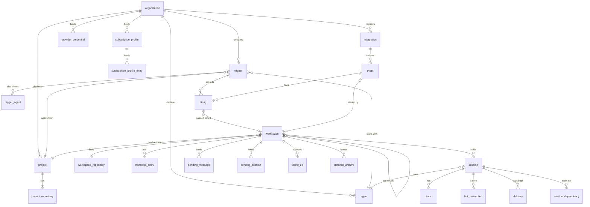

# Data model

The SQLite schema in `crates/kestrel/src/store/migrations/`. Tables are `STRICT`; timestamps are
RFC 3339 text; IDs are UUIDv7 text. Read every migration for a table's current shape: several
tables gain columns in later files.

## Relationships

`organization_id` is on every table and omitted from the diagram.

## Tables

| Table | Holds | Notes |
| --- | --- | --- |
| `organization` | The boundary | `max_live_instances` caps Instances across its Workspaces. |
| `project`, `project_repository` | Repositories and default branch | Ordered by `position`; the first is where ACP sessions are rooted. |
| `agent` | Harness and optional model | A null `model` means the harness default. |
| `provider_credential` | Organization secrets by variable name | `sealed` is encrypted with `kestrel.key`. |
| `subscription_profile`, `…_entry` | A person's harness login | Entries are `variable` or `file`, sealed. |
| `integration` | GitHub or generic webhook | `CHECK`s tie columns to `kind`. GitHub's `signing_secret` is sealed, but its `credential` (the token) is stored as given; a webhook keeps `shared_secret_digest`. Poll cursors and the last refusal live here. |
| `event` | Every recorded CloudEvent | `integration_id` null for minted Events. |
| `trigger`, `trigger_agent` | The rule and its allowed Agents | Exactly one of `filter`, `every_ms`, `cron`. `due_at` is set only for schedules. |
| `firing` | One Trigger × one Event | `outcome` ∈ opened, fed, ignored, held, canceled, failed; `CHECK`s tie `workspace_id`, `failure` and `considered_at` to it. |
| `workspace`, `workspace_repository` | The durable place | Checkout fixed at open (`base`, `branch`, repositories). `instance`, `observed` (last git report) and `last_active_at` are current values. |
| `transcript_entry` | The Transcript | `(workspace_id, seq)`; indexed by Workspace, kind and seq. `session_id` attributes entries; `body` is a JSON `log::Entry` tagged by `type`. |
| `session` | One harness execution | State, lease, the Instance and supervisor it ran on, exit, usage, models, `reports_taken`. |
| `turn` | One prompt and answer | `from_seq` anchors which Transcript entries are this Turn's response. |
| `supervisor` | An Instance's supervisor | One row per Instance: its name, version, when it last reached the link, and its link credential's digest. Replaced when another is started; deleted when the Instance is let go. |
| `link_instruction` | Instructions sent down the link | `(instance, seq)`; `seq` is the SSE event id, and `session_id` the Session each is for. |
| `pending_message`, `pending_session` | Input held for the unfinished Session | See [Sessions](sessions.md#the-unfinished-session). |
| `follow_up` | Which comment Events fed which Workspace | One per Event, so a comment is taken once. |
| `delivery` | Comments to post back | `(session_id, turn)`; `turn = 0` is the Outcome. |
| `session_dependency` | Session waits on blocker | Drives Unreachable. |
| `instance_archive` | Instances waiting to be destroyed | Written when a Workspace seals or releases. |
| `work_role` | The dispatching role's limits | Rewritten at start so the queue view reports the limits actually enforced. |

## Rules the schema carries

- **Invariants live in constraints where SQLite can hold them.** Examples: one open Workspace per
  correlation (`workspace_open_correlation`, a partial unique index), one firing per Trigger and
  Event (primary key), and a firing's outcome agreeing with its columns (`CHECK`). Prefer adding a
  constraint to checking in Rust.
- **State is current values, never derived from history.** `workspace.observed`,
  `session.state` and the like are updated in place; nothing replays the Transcript to rebuild them.
- **Secrets are sealed or digested.** Sealed values need `kestrel.key` beside the database;
  digested ones cannot be recovered. The one exception is a GitHub Integration's token, which is
  stored in plain text.
- **Schema changes edit the migrations in place** until release (see Compatibility in `AGENTS.md`),
  even though several existing migrations are `ALTER TABLE`s.
