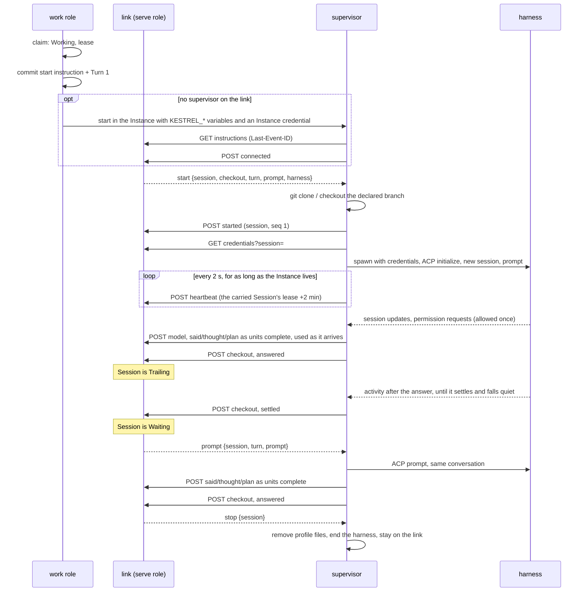

# Link

The HTTP boundary between a supervisor inside an Instance and the control plane: server-sent
events down, POSTs up ([ADR-0002](../adr/0002-two-deployables-the-environment-dials-out.md)).
`openapi/link.json` is the contract. Server: `crates/kestrel/src/link/`, report handling in
`work::report`. Client: `crates/kestrel-supervisor/src/link.rs` and `lib.rs`.

The supervisor lives with its Instance, not its Session
([ADR-0039](../adr/0039-the-supervisor-lives-with-its-instance.md)): it dials as the Instance, and
every Session on the Instance is begun, prompted and stopped over the one link.

## Endpoints

All under `/link/instances/{instance}`, the Instance's `<driver>/<name>` as one percent-encoded
segment:

| Method | Path | Purpose |
| --- | --- | --- |
| `GET` | `/instructions` | SSE stream of the Instance's instructions after `Last-Event-ID`. Closes once the Instance is let go. |
| `POST` | `/reports` | One report. `202` when taken, including a replay. `connected` returns the Workspace checkout declaration. |
| `GET` | `/credentials?session=` | Provider Credentials and Subscription Profile contents for a Session the Instance carries, decrypted for this request. |
| `PATCH` | `/credentials?session=` | Hands back profile files the harness refreshed. |
| `GET` | `/entries` | Pages the Workspace's Transcript with payload content hydrated for supervisor context. The supervisor does not currently call it. |
| `POST` | `/answers/{request}` | The streamed answer to a read. `204` once the operator has taken it; `410` when nobody waits on it. |

## Live work reports

The unnumbered `work` report carries each repository's current branch, changed and staged file
and line counts, commits no remote-tracking branch reaches on any branch or detached HEAD with
line counts, `origin/<declared>`'s commit, and untracked and stash counts. The supervisor sends it
on connect, at turn close, and when a two-second check during a working turn finds a change.
Every supervisor git command sets `GIT_OPTIONAL_LOCKS=0`.

`live_work::Summaries` belongs to the serve role and is shared by its link and operator routers.
It holds reports with their arrival times only while the Instance has an open instruction stream.
The operator also checks the supervisor's heartbeat freshness before serving a summary. The
separate numbered `checkout` report remains durable and supplies the reaping gate only.

## Reads

An operator's read of an Instance's files goes down the Instance's stream as a transient `read`
event with a request id and no event id: it is never stored and a reconnect never replays it. The
supervisor answers each in its own task, so a working turn never holds one up, by POSTing to
`/answers/{request}`: JSON for a listing, inline text or a refusal, or the raw bytes of a file.

`live_read::Reads` belongs to the serve role and is where requests and answers meet. A read with no
answer begun within 10 s, or on an Instance with no open stream, fails as "the Instance didn't
answer". Identical reads in flight share one request, and a JSON answer up to 2 MiB is reused for
5 s; raw bytes are piped through unbuffered and never shared. Nothing about a read is written to
Store.

The supervisor resolves `<repo>/<path>` through symlinks and refuses anything outside that
repository's checkout (`files.rs`). A listing is one level, at most 5,000 entries, each marked
tracked, untracked or ignored from `git ls-files`. Text up to 1 MiB is answered inline; a binary
file, a larger one, or a `raw` read is streamed.

## A Session over the link

## Instructions

`link::Instruction`, stored in `link_instruction` with a per-Instance `seq` that is the SSE event id.
Each names the Session it is for.

- `start {checkout, turn, prompt, harness}`: take up the Session. `turn` is the seq of the Turn the
  prompt begins, as on `prompt`. `harness` is the command, model and ACP
  auth method to spawn, since each Session may choose its Agent. A `start` for the Session already
  carried is ignored.
- `unbriefed {checkout, harness}`: take up the Session with no Brief. It checks out, opens the ACP
  conversation and prompts nothing, reporting `ready`; the Session waits unbriefed and its first
  message later arrives as an ordinary `prompt` ([ADR-0038](../adr/0038-a-session-may-start-before-its-brief.md)).
  A checkout or spawn that fails is reported as the Session finished failed, exactly as a `start`'s
  would be.
- `prompt {turn, prompt}`: the next Turn, `turn` its seq, in the same ACP conversation. Sending it moves the Session from
  Waiting to Working in the same transaction. An unbriefed Session's first `prompt` is its Brief:
  it moves the Session from Unbriefed to Working, and the supervisor reports `started` as its
  first Turn begins.
- `interrupt {turn}`: cancel the Turn the Session is in without ending it. A supervisor whose Turn
  in flight is not `turn` ignores it, so a cancel that lands after its Turn answered never cancels
  the next one. Otherwise the supervisor sends ACP
  `session/cancel`, answers permission requests that arrive while the cancel is in flight
  `cancelled`, and waits for the prompt to return; a `cancelled` prompt closes its open units
  `interrupted` and is reported as `interrupted` instead of `answered`. A prompt that returns any
  other way ends the Turn as it would have. The supervisor counts `KESTREL_INTERRUPT_DEADLINE`
  (30 s) from the instruction: an agent that does not answer by then has its harness ended, its open
  units closed `unresolved`, and its Session reported finished failed, lost ACP continuity.
- `set_option {option, value, participant}`: change one of the Session's options between Turns.
  The supervisor sends ACP `session/set_config_option`, or `session/set_mode` for a mode it
  synthesized from legacy `modes`, and reports `option_changed`. It is written in the transaction
  that checks the Session is not working, so it reaches the harness ahead of any later `prompt`.
- `stop`: sent whenever a Session ends, however it ends, so the next Session's `start` always follows
  the last one's `stop`. It ends the harness; the supervisor stays.

A supervisor started on an Instance that already has a stream is handed `KESTREL_INSTRUCTIONS_AFTER`,
the position before the Session it is started for, so it never replays an earlier Session.

The stream polls `Store` every 100 ms; nothing notifies it.

## Reports

`work::Report`, one per POST. `connected` and `heartbeat` are about the Instance; every other report
names its Session, which must be one the Instance carries (unended, lease not passed), or it is
answered `410` and the supervisor lets that Session go. Each is applied in one transaction with its
effects (ADR-0004).

| Report | Numbered | Effect |
| --- | --- | --- |
| `connected {version}` | no | Records the supervisor version on the Instance and its live Sessions; an unbriefed one stops provisioning. |
| `heartbeat` | no | Records the supervisor reached the link; extends the live Sessions' leases to now + 2 min, never one already passed. |
| `stderr {lines}` | no | Logged to the operator, never the Transcript. |
| `ready` | no | An unbriefed Session's harness is up and its conversation open: records `harness_ready`. |
| `started` | yes | Appends `SessionStarted`. |
| `model {model}` | yes | Records the model the harness is actually on. |
| `said {message, completion}` | yes | Appends shared-state `Said`, naming its Session. Like `thought`, `plan` and `tool_call`, it moves a Waiting Session to Trailing. |
| `thought {text, completion}` | yes | Appends narration `Thought`. |
| `plan {entries, completion}` | yes | Appends one narration plan replacement. |
| `tool_call {call_id, title, tool_kind, status, input, result, closing_reason, completion}` | yes | Appends one completed detail entry. |
| `session_state {tools, units, message_buffering, thought_buffering, usage?, last_activity_at?}` | no | Each tool is `{call_id, title, tool_kind, status, started_at}`; `units` are the adapter units still open, which the Session read and `session show` list. Replaces the Session’s transient snapshot in serve-role memory; reconnect resends it. `last_activity_at` is present only while the supervisor trails; a Waiting Session that reports it moves to Trailing. |
| `usage {usage}` | no | Held in serve-role memory beside the running tools: at most one a second, at the window's trailing edge, and never recorded (ADR-0041). |
| `session_info {title, options, commands}` | no | Records the harness's whole bookkeeping state on the Session (ADR-0041). Sent when it changes, at most once a second, and again after a reconnect. |
| `option_changed {participant, option, category, from, to?, refused?, options}` | yes | Clears the pending change, records the harness's options, and appends shared-state `OptionChanged` naming who asked, with `refused` in place of `to` when the harness refused. Leaves the Session's state as it was. |
| `checkout {repositories}` | yes | Replaces the Workspace's observed git state (decides Unpublished Work); an unbriefed Session moves from `cloning` to `starting_harness`. |
| `answered {usage?}` | yes | Closes the open Turn, moves the Session to Trailing, clears any pending interrupt, records a delivery from what was said up to it, and records the usage it carries; held messages become the next Turn at once, so the Session stays Working when there are any. |
| `interrupted {trailing}` | yes | Closes the interrupted Turn, moves the Session to Waiting, or to Trailing when `trailing` says units the agent started still run, and appends shared-state `TurnInterrupted` naming who asked; held messages become the next Turn at once, so the Session stays Working when there are any. Writes no delivery. |
| `settled` | yes | Moves a Trailing Session to Waiting and records the Workspace active. Follows the `checkout` observed then. |
| `finished {exit, usage?}` | yes | Ends the Session, recording the usage it carries. |

**Numbered reports are exactly-once.** The supervisor numbers each Session's reports from 1 and
resends from the first one not acknowledged. The control plane keeps `session.reports_taken`: the
next number is applied, an old one is acknowledged and ignored, and a gap is refused with `400`. A
supervisor sends completed units immediately, and `model` as it arrives. Usage and bookkeeping are
transient and unnumbered; a Turn's answer and a Session's end carry the usage that stands. It
reports `checkout` and then `answered` or `finished` at the Turn boundary, and `checkout` and then
`settled` when trailing ends.

## Authentication

Every request carries `Authorization: Bearer <credential>`. The credential is minted when the work
role starts a supervisor and passed as `KESTREL_INSTANCE_CREDENTIAL`; the `supervisor` row keeps only
its digest. A request is refused when:

- the credential is unknown, replaced by another supervisor's, or its Instance has been let go
  (released, archived, or lost) (`401`). The supervisor exits on it;
- it belongs to another Instance (`403`).

There is no Session credential and no per-Session route. A refusal caused by SQLite contention
answers `503` with `Retry-After: 1`.

## Lease, reconnect and giving up

| Constant | Value | Where |
| --- | --- | --- |
| Lease | 2 min | `work::LEASE`, passed as `KESTREL_LEASE` |
| Heartbeat | every 2 s | `HEARTBEAT_EVERY` in the supervisor |
| On the link | reached within 6 s | `ON_THE_LINK` in the work role |
| Reconnect delay | 250 ms | `RECONNECT_AFTER` |
| Give up on a Session | lease + 5 s since the link last answered | `GIVE_UP_MARGIN` |

- The lease is what outlives a control-plane restart. A supervisor keeps its harness and
  conversation across a lost link and reconnects with its instruction cursor and unacknowledged
  reports ([ADR-0024](../adr/0024-a-run-spans-prompt-turns.md)).
- The lease sweep ends any Working or Waiting Session whose lease has passed, as failed.
- A supervisor that has not reached the link for longer than the lease ends the Session's harness
  and lets the Session go, since the control plane has already let it go. It keeps redialing for
  as long as the Instance lives.
- A supervisor the work role holds that exits fails the Session it was carrying at once. After a
  restart, one that has died is found by its lease and replaced before the next Session.

## Credentials at the spawn

The supervisor fetches credentials only when it opens the conversation, never at provision
([ADR-0010](../adr/0010-a-provider-credential-crosses-the-link-at-the-spawn.md)).

- Variables go into the harness process's environment only.
- Subscription Profile files are written beneath the agent's home, handed back with `PATCH` after
  every Turn so a rotated login is saved while the Session is still carried, and removed when the
  Session is let go ([ADR-0025](../adr/0025-subscription-profiles-are-personal.md)).
- Decryption uses `kestrel.key` beside the database (`keyring.rs`).

## Harness side

`kestrel-supervisor/src/harness.rs` is an ACP client ([ADR-0007](../adr/0007-acp-is-the-agent-runtime-contract.md))
with no branch on which harness it drives.

- One ACP session per kestrel Session, rooted in the checkout of the Workspace's first repository.
- The `start`'s model is set over ACP after the session opens; none leaves the harness default.
- The `start`'s auth names an ACP auth method for harnesses that require a login.
- `KESTREL_`-prefixed variables, the Instance credential among them, are removed from the harness's
  environment.
- Every `initialize` declares `clientCapabilities._meta.jetbrains.air = {version: 1, capabilities:
  ["asyncTasks", "nativeSubagentSessions"]}`, whatever the harness; one that doesn't know the key
  ignores it.
- `session/update` is taken untyped, since adapters send variants ACP v1 doesn't define. A
  variant kestrel can't read is an operator diagnostic, never a failed notification.
- Claude's `async_task_spawned` opens a `background_task` unit keyed by `asyncTaskId` and titled
  by its `name`; `async_task_progress` and an `async_task_state_update` of `running` or `paused`
  are activity; one of `completed`, `failed` or `stopped` settles it. A settled unit adds no
  Transcript entry.
- Claude's `subagent_spawned` opens a `subagent` unit keyed by `subagentSessionId` and titled by
  its `name`; a `subagent_state_update` of `completed`, `failed`, `cancelled` or `disconnected`
  settles it. Declaring native subagents moves all their output off the parent session, so an
  update under a known subagent session is folded into the parent's completer, and only there,
  its `toolCallId` prefixed `<subagent>:` so two subagents' calls can't collide.
- `session/request_permission` is answered with the agent's own allow-once option
  (`permission.rs`). There is no policy yet.
- The pure completer buffers messages and thoughts independently by ID, completes chunks without
  IDs immediately, and records each plan replacement. ID changes and Turn boundaries close text
  units; updates for a completed unit become operator diagnostics. Tool starts and updates maintain
  transient Session state, and terminal updates complete one detail entry. Open tools close
  interrupted on cancellation and failed on failure.
- The completer keeps running between Turns. An answer leaves open tools open and starts the
  Session trailing. Message and thought chunks, plans, tool calls and their updates are activity
  and restart the quiet period (`KESTREL_QUIET_PERIOD`, 30 s, handed down by the work role), as
  does any change to an adapter unit; bookkeeping never does. Open units carry over into the next
  Turn, and a cancelled or failed one drops them. Once no tool or unit is open and the quiet
  period has passed, the supervisor
  closes buffered text, closes any tool still open unresolved, and reports `checkout` and
  `settled`. Activity after that trails again. A tool still open when trailing ends any other way
  closes unresolved. A tool open when the next Turn starts stays open into it.
- A Turn in which the agent produced no message, thought, plan or tool call fails the Session.
- `checkout.rs` clones each repository side by side under `/workspace`, cuts the declared branch
  from the base when the remote lacks it, and leaves an existing checkout as an earlier Session
  left it.

Trailing is the ACP-only baseline of
[ADR-0040](../adr/0040-a-session-trails-its-answer-while-its-work-runs.md); the
[architecture map](README.md#where-the-code-lags-the-adrs) records what of it is not built yet.
