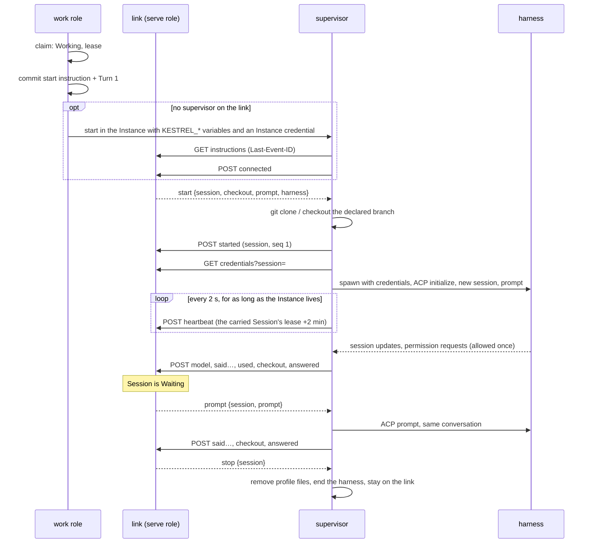

# Link

The HTTP boundary between a supervisor inside an Instance and the control plane: server-sent
events down, POSTs up ([ADR-0002](../adr/0002-two-deployables-the-environment-dials-out.md)).
`openapi/link.json` is the contract. Server: `crates/kestrel/src/link/`, report handling in
`work::report`. Client: `crates/kestrel-supervisor/src/link.rs` and `lib.rs`.

The supervisor lives with its Instance, not its Session
([ADR-0039](../adr/0039-the-supervisor-lives-with-its-instance.md)): it dials as the Instance, and
every Session on the Instance is begun, prompted and stopped over the one link.

## Endpoints

All under `/link/instances/{instance}`, the Instance's `<driver>/<name>` as one percent-encoded
segment:

| Method | Path | Purpose |
| --- | --- | --- |
| `GET` | `/instructions` | SSE stream of the Instance's instructions after `Last-Event-ID`. Closes once the Instance is let go. |
| `POST` | `/reports` | One report. `202` when taken, including a replay. |
| `GET` | `/credentials?session=` | Provider Credentials and Subscription Profile contents for a Session the Instance carries, decrypted for this request. |
| `PATCH` | `/credentials?session=` | Hands back profile files the harness refreshed. |
| `GET` | `/entries` | Pages the Workspace's Transcript. The supervisor does not currently call it. |

## A Session over the link

## Instructions

`link::Instruction`, stored in `link_instruction` with a per-Instance `seq` that is the SSE event id.
Each names the Session it is for.

- `start {checkout, prompt, harness}`: take up the Session. `harness` is the command, model and ACP
  auth method to spawn, since each Session may choose its Agent. A `start` for the Session already
  carried is ignored.
- `prompt {prompt}`: the next Turn in the same ACP conversation. Sending it moves the Session from
  Waiting to Working in the same transaction.
- `stop`: sent whenever a Session ends, however it ends, so the next Session's `start` always follows
  the last one's `stop`. It ends the harness; the supervisor stays.

A supervisor started on an Instance that already has a stream is handed `KESTREL_INSTRUCTIONS_AFTER`,
the position before the Session it is started for, so it never replays an earlier Session.

The stream polls `Store` every 100 ms; nothing notifies it.

## Reports

`work::Report`, one per POST. `connected` and `heartbeat` are about the Instance; every other report
names its Session, which must be one the Instance carries (unended, lease not passed), or it is
answered `410` and the supervisor lets that Session go. Each is applied in one transaction with its
effects (ADR-0004).

| Report | Numbered | Effect |
| --- | --- | --- |
| `connected {version}` | no | Records the supervisor version on the Instance and its live Sessions. |
| `heartbeat` | no | Records the supervisor reached the link; extends the live Sessions' leases to now + 2 min, never one already passed. |
| `stderr {lines}` | no | Logged to the operator, never the Transcript. |
| `started` | yes | Appends `SessionStarted`. |
| `model {model}` | yes | Records the model the harness is actually on. |
| `said {message}` | yes | Appends `Said`. |
| `used {usage}` | yes | Records cumulative context use and cost. |
| `checkout {repositories}` | yes | Replaces the Workspace's observed git state (decides Unpublished Work). |
| `answered` | yes | Closes the open Turn, moves the Session to Waiting, records a delivery. |
| `finished {exit}` | yes | Ends the Session. |

**Numbered reports are exactly-once.** The supervisor numbers each Session's reports from 1 and
resends from the first one not acknowledged. The control plane keeps `session.reports_taken`: the
next number is applied, an old one is acknowledged and ignored, and a gap is refused with `400`. A
supervisor reports `model`, `said`, `used`, `checkout` and then `answered` or `finished` after every
Turn.

## Authentication

Every request carries `Authorization: Bearer <credential>`. The credential is minted when the work
role starts a supervisor and passed as `KESTREL_INSTANCE_CREDENTIAL`; the `supervisor` row keeps only
its digest. A request is refused when:

- the credential is unknown, replaced by another supervisor's, or its Instance has been let go
  (released, archived, or lost) (`401`). The supervisor exits on it;
- it belongs to another Instance (`403`).

There is no Session credential and no per-Session route. A refusal caused by SQLite contention
answers `503` with `Retry-After: 1`.

## Lease, reconnect and giving up

| Constant | Value | Where |
| --- | --- | --- |
| Lease | 2 min | `work::LEASE`, passed as `KESTREL_LEASE` |
| Heartbeat | every 2 s | `HEARTBEAT_EVERY` in the supervisor |
| On the link | reached within 6 s | `ON_THE_LINK` in the work role |
| Reconnect delay | 250 ms | `RECONNECT_AFTER` |
| Give up on a Session | lease + 5 s since the link last answered | `GIVE_UP_MARGIN` |

- The lease is what outlives a control-plane restart. A supervisor keeps its harness and
  conversation across a lost link and reconnects with its instruction cursor and unacknowledged
  reports ([ADR-0024](../adr/0024-a-run-spans-prompt-turns.md)).
- The lease sweep ends any Working or Waiting Session whose lease has passed, as failed.
- A supervisor that has not reached the link for longer than the lease ends the Session's harness
  and lets the Session go, since the control plane has already let it go. It keeps redialing for
  as long as the Instance lives.
- A supervisor the work role holds that exits fails the Session it was carrying at once. After a
  restart, one that has died is found by its lease and replaced before the next Session.

## Credentials at the spawn

The supervisor fetches credentials only when it opens the conversation, never at provision
([ADR-0010](../adr/0010-a-provider-credential-crosses-the-link-at-the-spawn.md)).

- Variables go into the harness process's environment only.
- Subscription Profile files are written beneath the agent's home, handed back with `PATCH` after
  every Turn so a rotated login is saved while the Session is still carried, and removed when the
  Session is let go ([ADR-0025](../adr/0025-subscription-profiles-are-personal.md)).
- Decryption uses `kestrel.key` beside the database (`keyring.rs`).

## Harness side

`kestrel-supervisor/src/harness.rs` is an ACP client ([ADR-0007](../adr/0007-acp-is-the-agent-runtime-contract.md))
with no branch on which harness it drives.

- One ACP session per kestrel Session, rooted in the checkout of the Workspace's first repository.
- The `start`'s model is set over ACP after the session opens; none leaves the harness default.
- The `start`'s auth names an ACP auth method for harnesses that require a login.
- `KESTREL_`-prefixed variables, the Instance credential among them, are removed from the harness's
  environment.
- `session/request_permission` is answered with the agent's own allow-once option
  (`permission.rs`). There is no policy yet.
- Only message chunks and usage are kept; thoughts, plans and tool calls are dropped
  ([ADR-0020](../adr/0020-the-transcript-records-what-the-runtime-emits-in-kinds.md) is not built).
- A Turn in which the agent produced no message, thought, plan or tool call fails the Session.
- `checkout.rs` clones each repository side by side under `/workspace`, cuts the declared branch
  from the base when the remote lacks it, and leaves an existing checkout as an earlier Session
  left it.
