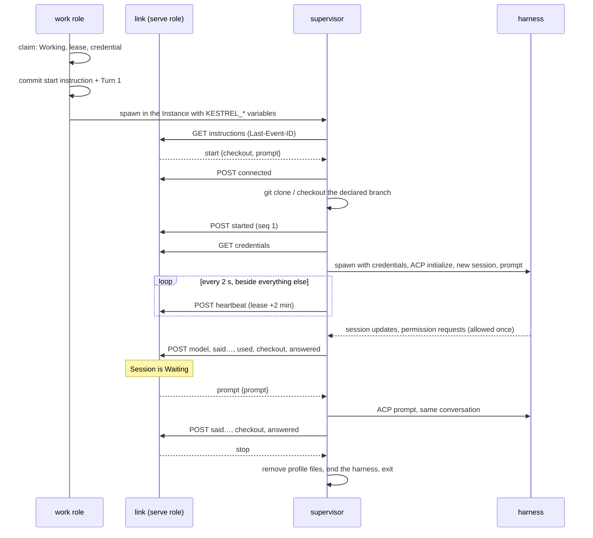

# Link

The HTTP boundary between a supervisor inside an Instance and the control plane: server-sent
events down, POSTs up ([ADR-0002](../adr/0002-two-deployables-the-environment-dials-out.md)).
`openapi/link.json` is the contract. Server: `crates/kestrel/src/link/`, report handling in
`work::report`. Client: `crates/kestrel-supervisor/src/link.rs` and `lib.rs`.

## Endpoints

All under `/link/sessions/{session}`:

| Method | Path | Purpose |
| --- | --- | --- |
| `GET` | `/instructions` | SSE stream of instructions after `Last-Event-ID`. Closes once the Session has ended. |
| `POST` | `/reports` | One report. `202` when taken, including a replay. |
| `GET` | `/credentials` | Provider Credentials and Subscription Profile contents, decrypted for this request. |
| `PATCH` | `/credentials` | Hands back profile files the harness refreshed. |
| `GET` | `/entries` | Pages the Workspace's Transcript. The supervisor does not currently call it. |

## A Session over the link

## Instructions

`link::Instruction`, stored in `link_instruction` with a per-Session `seq` that is the SSE event id.

- `start {checkout, prompt}`: taken once; a second `start` is ignored.
- `prompt {prompt}`: the next Turn in the same ACP conversation. Sending it moves the Session from
  Waiting to Working in the same transaction.
- `stop`: sent when the control plane ends a Session, so the supervisor leaves instead of dialling
  back in to be refused.

The stream polls `Store` every 100 ms; nothing notifies it.

## Reports

`work::Report`, one per POST. Each is applied in one transaction with its effects (ADR-0004).

| Report | Numbered | Effect |
| --- | --- | --- |
| `connected {version}` | no | Records the supervisor version. |
| `heartbeat` | no | Extends the lease to now + 2 min. |
| `stderr {lines}` | no | Logged to the operator, never the Transcript. |
| `started` | yes | Appends `SessionStarted`. |
| `model {model}` | yes | Records the model the harness is actually on. |
| `said {message}` | yes | Appends `Said`. |
| `used {usage}` | yes | Records cumulative context use and cost. |
| `checkout {repositories}` | yes | Replaces the Workspace's observed git state (decides Unpublished Work). |
| `answered` | yes | Closes the open Turn, moves the Session to Waiting, records a delivery. |
| `finished {exit}` | yes | Ends the Session. |

**Numbered reports are exactly-once.** The supervisor numbers them from 1 and resends from the
first one not acknowledged. The control plane keeps `session.reports_taken`: the next number is
applied, an old one is acknowledged and ignored, and a gap is refused with `400`. A supervisor
reports `model`, `said`, `used`, `checkout` and then `answered` or `finished` after every Turn.

## Authentication

Every request carries `Authorization: Bearer <credential>`. The credential is minted at claim and
passed to the supervisor as `KESTREL_SESSION_CREDENTIAL`; `session_credential` keeps only its
digest. A request is refused when:

- the credential is unknown, invalidated (the Session ended), or past its 12-hour lifetime. It is
  not renewed;
- it belongs to another Session (`403`);
- the Session's lease has lapsed (`403`), so a control plane coming back never takes a supervisor's
  word for a Session the sweep is about to end.

A refusal caused by SQLite contention answers `503` with `Retry-After: 1`.

## Lease, reconnect and giving up

| Constant | Value | Where |
| --- | --- | --- |
| Lease | 2 min | `work::LEASE`, passed as `KESTREL_LEASE` |
| Heartbeat | every 2 s | `HEARTBEAT_EVERY` in the supervisor |
| Reconnect delay | 250 ms | `RECONNECT_AFTER` |
| Give up | lease + 5 s since the link last answered | `GIVE_UP_MARGIN` |

- The lease is what outlives a control-plane restart. A supervisor keeps its harness and
  conversation across a lost link and reconnects with its instruction cursor and unacknowledged
  reports ([ADR-0024](../adr/0024-a-run-spans-prompt-turns.md)).
- The lease sweep ends any Working or Waiting Session whose lease has passed, as failed.
- A supervisor that has not reached the link for longer than the lease gives up and exits, since
  the control plane has already let the Session go.
- Killing the supervisor ends the Session: nothing restarts it, and the lease lapses.

## Credentials at the spawn

The supervisor fetches credentials only when it opens the conversation, never at provision
([ADR-0010](../adr/0010-a-provider-credential-crosses-the-link-at-the-spawn.md)).

- Variables go into the harness process's environment only.
- Subscription Profile files are written beneath the agent's home, handed back with `PATCH` after
  every Turn so a rotated login is saved while the credential is still live, and removed when the
  Session stops or fails ([ADR-0025](../adr/0025-subscription-profiles-are-personal.md)).
- Decryption uses `kestrel.key` beside the database (`keyring.rs`).

## Harness side

`kestrel-supervisor/src/harness.rs` is an ACP client ([ADR-0007](../adr/0007-acp-is-the-agent-runtime-contract.md))
with no branch on which harness it drives.

- One ACP session per kestrel Session, rooted in the checkout of the Workspace's first repository.
- `KESTREL_AGENT_MODEL` is set over ACP after the session opens; empty leaves the harness default.
- `KESTREL_AGENT_AUTH` names an ACP auth method for harnesses that require a login.
- `session/request_permission` is answered with the agent's own allow-once option
  (`permission.rs`). There is no policy yet.
- Only message chunks and usage are kept; thoughts, plans and tool calls are dropped
  ([ADR-0020](../adr/0020-the-transcript-records-what-the-runtime-emits-in-kinds.md) is not built).
- A Turn in which the agent produced no message, thought, plan or tool call fails the Session.
- `checkout.rs` clones each repository side by side under `/workspace`, cuts the declared branch
  from the base when the remote lacks it, and leaves an existing checkout as an earlier Session
  left it.
