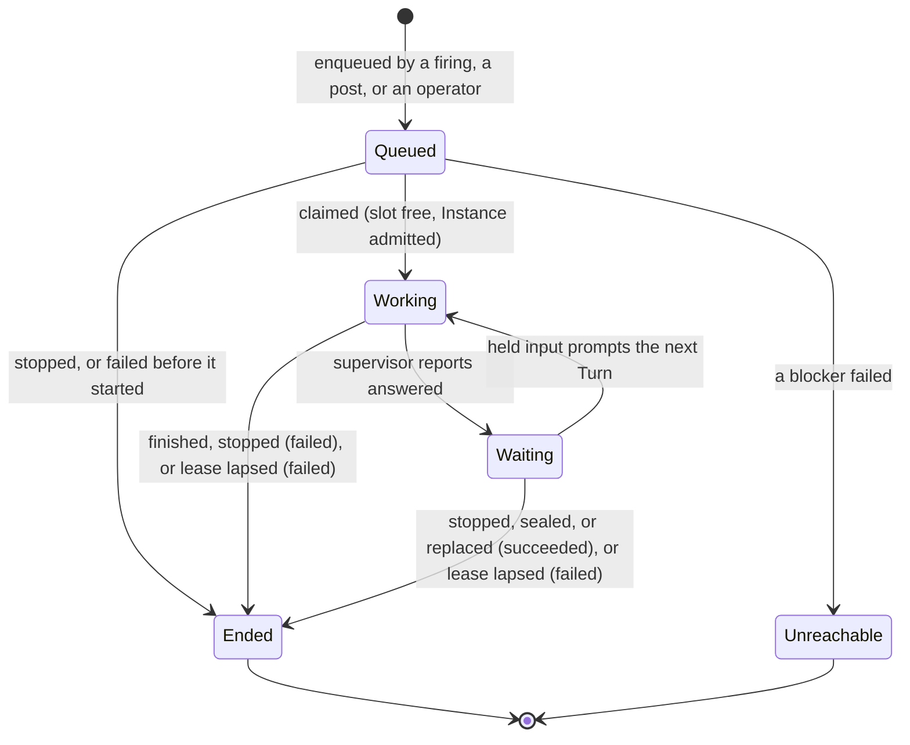
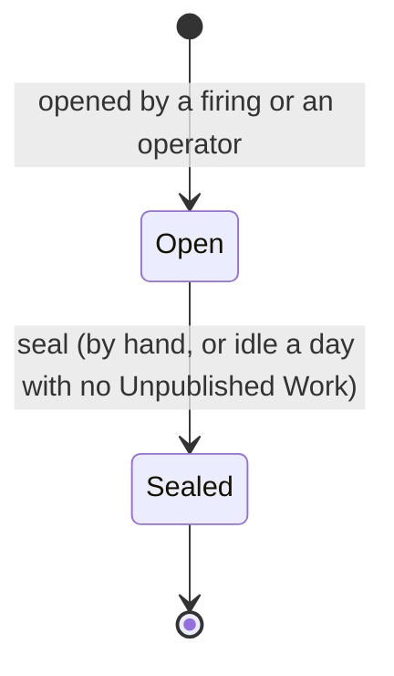

# Sessions

How a Session is queued, claimed, executed, waits between Turns and ends, and how its Workspace
holds an Instance and seals. Code: `work.rs`, `workspace.rs`, `instance.rs`, `role/work.rs`,
`store/workspace.rs`.

## Session states

`domain::SessionState`, stored as `session.state`.

- **Only Working occupies an active-work slot** (`occupying_slots` counts `state = 'working'`).
  Waiting holds its Instance and ACP conversation but no slot ([ADR-0024](../adr/0024-a-run-spans-prompt-turns.md)).
- **A Session ends once.** `work::ending` is the single path; whoever reaches it first (the
  supervisor's `finished`, a stop, the lease sweep, the claimant failing) sets the exit, and later
  callers get the exit that stands. Ending appends `SessionEnded`, invalidates the link
  credential, records the Outcome delivery, and cascades Unreachable to dependents of a failure.
- **Stopping a Waiting Session succeeds** (`SessionState::stop_exit`). It has answered everything
  it was asked; ending it mid-turn is a failure.
- **Unreachable has no exit.** A queued Session whose blocker failed never ran, so nothing failed
  (`cascade_unreachable`, `session_dependency`).
- **A queued Session may wait for an Instance.** When the Organization's `max_live_instances` is
  full, `instance::admission` judges it without acting: another Instance is being archived, an
  idle one is safe to archive, or none is recoverable. Only the dispatcher's claim archives the
  idle one (`instance::reclaim`), and only for a Session it could claim; the claim moves on
  either way.
- **Nothing stores why a Session waits.** `queue::snapshot` derives positions and reasons at read
  time from the dispatcher's own rules: `UNSATISFIED_BLOCKER`, the `profile_held!` conflict,
  Working as the only slot occupant, `held_input!` ordering and `work::goes_before_input`. A rule
  changed in one place changes both: unless older held input is prompted first, a free slot
  claims position 1.

## Declared options

A Session starts with the harness options its declaration named: `model`, `mode` and
`thought_level`, each a harness value id, resolved per category — the Session's own over its
Trigger's over its Agent's, a category named none staying at the harness's default (ADR-0041).
The resolved values are frozen onto the Session at enqueue (`session.model`, `session.mode`,
`session.thought_level`) and travel to the supervisor in the `start` instruction's `harness`.
The supervisor checks each declared category against what the harness offers at setup and fails
the Session naming the category and the value when there is no way to set it or the value is not
offered; a declared mode a harness offers only as a legacy `modes` entry is set through
`session/set_mode`. Recovery applies the declared values again. `PUT …/agents/{agent}/model`
reaches no Session already enqueued.

## The unfinished Session

A Workspace has at most one **Unfinished Session**: queued, working or waiting. Its successor never
shares the checkout with it: every ending sends the Session's `stop` down its Instance's stream, and
the successor's `start` follows it ([Link](link.md#instructions)).

What arrives while one exists is held, never interleaved:

| Arrives | Held in | Released when |
| --- | --- | --- |
| A message (post, follow-up comment, a `continue` firing) | `pending_message` | A Waiting Session is prompted with it once a slot is free (`work::occupy`), or the next Session starts with it. |
| A `new-session` firing | `pending_session` | The unfinished Session lets go. A Waiting one is ended (succeeded) to make way. |

`work::continue_pending` runs as the unfinished Session ends and releases the next thing. A pending
Session wins over pending messages. Several held messages reach the agent as one attributed prompt
(`work::follow_up`); a lone one reaches it verbatim so a leading skill invocation still works.

## Execution

`role/work.rs::dispatching` loops every 100 ms:

1. Fail the Session of any supervisor this process started that has exited (`watch`), and forget
   that supervisor so the next Session starts another.
2. Stop the supervisor of, and destroy, each Instance queued in `instance_archive` (`archive`).
3. `work::occupy`: if a slot is free, claim the oldest claimable queued Session, or, if held input
   for a Waiting Session is older, prompt that instead. Claiming sets Working and starts a 2-minute
   lease in one guarded update, so a Session is dispatched at most once.
4. For a claim, `execute` in its own task:
   - Fail early if nothing can reach a model (no Provider Credential, Subscription Profile, or
     configured ACP login), or the work role has no command for the Agent's harness.
   - Resume the Workspace's Instance, or provision one. An Instance that has vanished ends the
     Session failed and clears the Workspace's Instance so the next Session starts fresh from the
     remote branch.
   - Commit the `start` instruction (checkout, prompt and the harness to spawn) and Turn 1 before
     any supervisor is started, so one that outlives this process still finds its start.
   - Begin the Session on the Instance's supervisor (`supervised`). One this process holds and is
     running, or one that reached the link within 6 s, is used as it is. Otherwise a recorded one is
     stopped by name, a new Instance credential is minted, and a new supervisor is started with
     `KESTREL_LINK`, `KESTREL_INSTANCE`, `KESTREL_INSTANCE_CREDENTIAL`, `KESTREL_LEASE` and
     `KESTREL_INSTRUCTIONS_AFTER`, the stream position before this `start`, so it never replays an
     earlier Session. Its stdout and stderr are relayed to the control plane's log.

The supervisor lives with the Instance, not the Session
([ADR-0039](../adr/0039-the-supervisor-lives-with-its-instance.md)). Nothing stops it when a
Session ends or the control plane stops; it goes when the Instance is destroyed. `LocalExec` kills
its process tree, and on Docker it dies with the container.

From there the Session is driven by what the supervisor reports ([Link](link.md)). The work role
retries dispatch, never work: a Session that failed is not re-run.

## Instances

A Workspace owns at most one Instance (`workspace.instance`) for its whole life
([ADR-0018](../adr/0018-an-instance-lives-until-its-session-seals.md)). Each Session records the
Instance it executed on as `<driver>/<name>`.

- **Unpublished Work** is judged from the last `checkout` report (`workspace.observed`,
  `instance::unpublished`). A checkout nobody reported on counts as holding work.
- **Leaving a Workspace.** Sealing or `instance release` moves the Instance into `instance_archive`
  in the same transaction; the dispatch loop destroys it later, so a work role that is down at seal
  time still finds it.
- **Release is the only way to discard Unpublished Work**, and only a person calls it. It appends
  `InstanceReleased` naming what was lost.

## Workspace states

- **Sealing refuses while a Session is in flight.** An idle seal additionally needs no Unpublished
  Work; `seal_idle` goes through the same `seal` a person calls.
- **A sealed Workspace is never reopened.** Work that correlates to one opens a new Workspace with
  `continues` pointing back and the sealed Workspace's branch ([Triggers](triggers.md#correlation)).
- `workspace.last_active_at` moves on each answered Turn; the idle sweep reads it.

## The first instruction

`link::start` builds Turn 1's prompt from the Transcript:

- A Brief nothing has followed is sent exactly as written.
- Otherwise the messages that started this Session, with earlier Transcript entries labelled as
  context ahead of them.
- Neither means the Session has no instruction and fails; kestrel does not improvise one.
