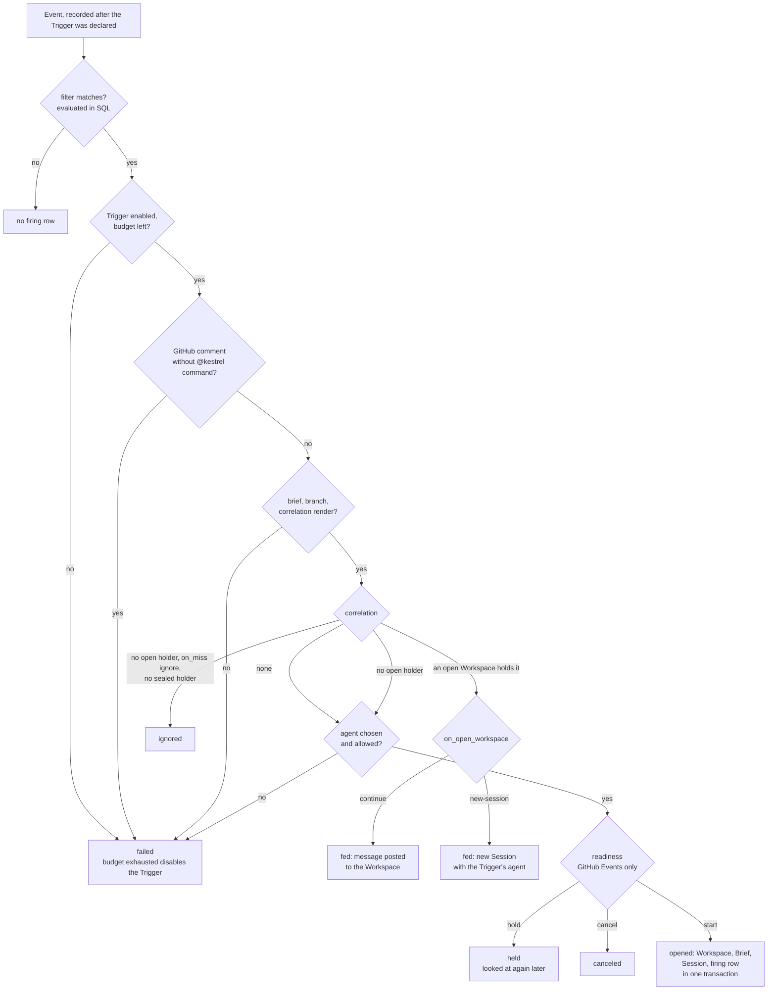

# Triggers

How Events get in, how a Trigger turns one into work, and how answers get back out. Code:
`integration/`, `trigger.rs`, `trigger/apply.rs`, `filter.rs`, `template.rs`, `cron.rs`,
`readiness.rs`, `follow_up.rs`, `store/trigger.rs`, `store/integration.rs`.

## Where Events come from

Every Event is a CloudEvent ([ADR-0011](../adr/0011-cloudevents-is-the-events-shape.md)), stored in
`event` and unique per `(organization, source, id)`, so a redelivery or overlapping poll records
nothing twice. A GitHub Event's `id` is its Delivery's GUID for every type, however it arrived
([ADR-0055](../adr/0055-a-github-integration-polls-its-apps-deliveries.md)).

| Source | Path | Authenticated by |
| --- | --- | --- |
| GitHub webhook | `POST /webhooks/{integration}` → `github::delivered` | HMAC `X-Hub-Signature-256` with the App's webhook secret |
| Generic webhook | `POST /webhooks/{integration}` → `webhook::received` | A shared secret whose digest is stored; binary or structured CloudEvents, or any other POST wrapped as `dev.kestrel.webhook.received` |
| GitHub poll | `timer::polling` → `integration::poll` → `github::delivered` | The App's own JWT, outbound: it lists `GET /app/hook/deliveries` and fetches each new Delivery's payload. Every inbound GitHub Integration polls, webhook or not. |
| Schedule | `trigger::elapse` | Minted by kestrel, with no Integration |
| Operator dispatch | `trigger::dispatch` → `dev.kestrel.dispatched` | The operator request ([ADR-0021](../adr/0021-a-push-is-an-event-kestrel-mints.md)) |

- Ingest only records and wakes the firing sweep. Nothing is matched on the request path.
- An unauthenticated request never becomes an Event, and says nothing about whether the
  Integration exists. The last refusal is kept on the Integration row for `integration list`.
- A poll reads the Delivery log back to `deliveries_read_from`, keeps its installation's and
  repository's (`repository_id`, learned at registration), and fetches only the payloads of
  Deliveries not yet recorded. It records them, moves `deliveries_read_from` to a minute before
  the newest `delivered_at` it listed (GitHub's clock, not kestrel's), and stamps
  `last_polled_at`, in one transaction; a payload it cannot fetch records nothing and moves
  nothing (ADR-0011). The first poll starts at registration.
- GitHub keeps Deliveries three days. When `last_polled_at` is older than that and the walk ran
  out before reaching where it started, the poll records on the Integration that some may have
  been lost; nothing is rebuilt from a resource read. A later refusal replaces that notice.

## Maintenance

An Integration's name, directions and poll interval change in place; its kind, API origin,
repository, App and installation never do
([ADR-0056](../adr/0056-an-integration-keeps-its-identity-through-maintenance.md)). Disabling it,
or taking a direction away, pauses that use and keeps the credentials, `deliveries_read_from` and
pending posts it resumes with: `due` polls only an enabled inbound one, its webhook refuses
(GitHub keeps the Delivery for the poll), `posts_due` skips it, and a firing from it is held
until it is enabled. Enabling makes it due a poll at once.

Every change bumps `revision`. Work that read the Integration before a change commits nothing:
the poll's and the webhook's write transactions, and a post's attempt and deferral, first ask
`integrations().current`, and the fenced `Github` client rechecks the revision before handing a
cached or newly minted installation token to a request. A request already sent is not recalled;
a post that may have landed is reconciled by its marker as before.

Retiring is the one change nothing undoes. `store/integration.rs::retire` nulls every secret
column on the row (the sealed private key, the signing secret, the shared-secret digest) and its
poll due time, and a `CHECK` keeps a retired row that way; a later operation that parks secret
material on the row erases it there. In the same transaction every post not yet posted is canceled
with its reason (`post.canceled_at`, `canceled_because`), which the Integration's record lists
beside `attempted_at`: a request already out may still land, and one that does is recorded as
posted after all. Every Firing held on one of its Events is canceled there too.
The row, its Events and everything referring to them stay. Afterwards every fence above refuses,
because a retired Integration is not enabled: a poll or Delivery read begun earlier asks GitHub
nothing more and commits nothing, the poll sweep drops its cached installation token, a Session
that ends records no post, a Firing matched later from an Event it recorded earlier is `canceled`
rather than held, and its repository no longer counts as watched. Maintenance and enable are refused with a
`state_conflict` that names no repair. Nothing is asked of GitHub: the App, its installation and
its keys are the operator's to remove, and the CLI says how.

## Firing

`timer::firing` calls `trigger::fire` on each tick or wake. It takes up to 32 unfired matches and
up to 32 held firings due for another look, and runs `trigger::firing` on each in its own
transaction.

Every outcome writes a `firing` row keyed by `(trigger, event)`, which is what keeps an Event from
firing a Trigger twice.

### Matching

- **The filter is SQL.** `store/trigger.rs::matching` compiles the filter dialect
  ([ADR-0012](../adr/0012-trigger-filters-are-a-dialect-not-a-language.md)) into a `WHERE` clause,
  with `data` paths addressed through JSON functions and every comparison coalesced to false. There
  is no second pass in Rust.
- **Only Events recorded after the Trigger was declared** (`recorded_at >= declared_at`).
  Declaring a Trigger never replays history.
- A scheduled Trigger matches only its own minted Events; a dispatched Event matches only the
  Trigger it was dispatched to.
- `filter::Author` gives filters GitHub's author association, so a filter can admit only
  `OWNER`, `MEMBER` or `COLLABORATOR`.

### Rendering

`trigger::render` fills the brief, branch and correlation from the Event with minijinja in strict
mode, bounded by fuel, recursion and output size (`template.rs`). The Agent, Project, Subscription
Profile and declared model, mode and thought level never render from an Event ([ADR-0013](../adr/0013-an-event-supplies-data-never-authority.md)).
A render failure fails the firing and starts nothing.

### Choosing the Agent

`trigger::chosen`: an explicit request (`agent=` in a command, or a dispatch) wins, then a single
`agent:<name>` label, then the Trigger's own Agent. Every choice must be the Trigger's Agent or one
in `trigger_agent`. Two `agent:` labels choose nothing.

### Correlation

`trigger::correlated` looks for the rendered key among the Organization's Workspaces:

- **An open Workspace holds it** (unique per Organization, enforced by a partial index): the firing
  feeds it, as `on_open_workspace` declares ([ADR-0031](../adr/0031-a-workspace-fixes-the-place-a-session-chooses-the-agent.md)).
- **Only a sealed one holds it**: a new Workspace opens with `continues` set and the sealed one's
  branch, even when `on_miss` is `ignore`, because that key was kestrel's own work.
- **Nothing holds it**: `on_miss` decides between opening and recording `ignored`.

A Trigger with no correlation always opens a new Workspace.

### Readiness

GitHub Events pass through `readiness.rs` before opening anything
([ADR-0023](../adr/0023-delegation-is-deliberate-and-readiness-is-live.md)). The GitHub Integration
fetches the issue's current state, delegation and blockers; `Readiness::decide` then:

| Request | Delegation gone | Closed / unknown | Blocked |
| --- | --- | --- | --- |
| Automatic (a matched Event) | cancel | hold | hold |
| Command (`@kestrel` comment) | cancel | hold | start, recording `worked_ahead` |
| Operator dispatch | start | start | start, recording `worked_ahead` |

A held firing is reconsidered after any newer Event from its Integration, after its Integration
is maintained, and at least every 5 minutes. An opening firing supersedes older held ones for the same Trigger and correlation. A
dispatch whose readiness cannot be read is refused rather than held, because the operator is
waiting on the answer.

### Budgets

Each Trigger may fire 10 times an hour (`FiringBudget::default`). The firing that exceeds it fails
and disables the Trigger with reason `firing-budget`; an operator re-enables it. A held firing is
counted once, when first recorded.

## Declaring Triggers

- `kestrel trigger declare` creates one Trigger from flags.
- `kestrel apply` reads `.kestrel/triggers.yaml` (`trigger/apply.rs`) and converges the applied set
  in one transaction: it removes only Triggers an apply created (`trigger.applied`), never ones
  declared by flags. A preview is the same transaction rolled back.
- `kestrel trigger test` renders against a real or supplied Event without recording anything, and
  reports what the firing would do.

## Follow-ups

`follow_up.rs` handles GitHub comments on a work item that already has a Workspace, independent of
Triggers:

- It finds the Workspace an Event's subject opened. If that one is sealed and a newer open
  Workspace holds its correlation, it uses the open one.
- A comment that is an `@kestrel` command belongs to the Triggers and is skipped here.
- A plain remark feeds an open Workspace only if the Trigger that opened it would admit the author.
  It is posted as a message ([Sessions](sessions.md#the-unfinished-session)).
- A comment whose author is the Integration's own recorded bot login feeds nothing, by author
  rather than by kestrel's post marker ([ADR-0028](../adr/0028-an-integration-lends-a-run-its-identity.md)).
  Trigger matching excludes its Events in the same way.

## Pull requests

`pull_request.rs` learns pull requests as Workspace state, independent of Triggers
([ADR-0032](../adr/0032-a-pull-request-event-updates-workspace-state-without-a-firing.md)):

- It reads only a GitHub Integration's `opened`, `reopened`, `closed` and `synchronize` Events,
  polled or delivered; other actions stay Organization Events and a generic webhook may name any type, so it
  proves nothing about GitHub.
- The payload's head repository and head branch must name exactly one open Workspace in the
  Event's Organization: one whose declared branch is the head branch and which fixes the head
  repository among its repositories. A fork is its own repository. Zero or several open candidates
  leave the Event unattached; one matching only sealed Workspaces is recorded as sealed and
  changes nothing.
- An attached Event appends a `pull_request` shared-state entry for each distinct observation — a
  delivery repeating one already held appends nothing — and updates the Workspace's current value
  for that repository and number. A value older at its source (`updated_at`) than the one held
  cannot roll it back; a conflicting tie on source freshness is settled by reading the pull request
  back from the Integration's repository, never by arrival order. It creates no Firing and prompts
  no Session, and a Trigger declared for the same Event fires as it would anyway.
- `pull_request_attachment` records every Event considered and its verdict, and
  `pull_request_candidate` every Workspace it matched with the state that Workspace was in, so each
  is considered once and the `0.5` Audit Record can explain the verdict.

## Posts

The outbound half (`integration/post.rs`, [ADR-0024](../adr/0024-a-run-spans-prompt-turns.md)); a
Delivery is always inbound:

- An `answered` report records a `post` row for that Turn's messages; ending a Session records
  one for its Outcome when it adds something the Turns did not.
- `timer::posting` posts each as a GitHub comment on the originating issue. `attempted_at` is set
  before the request, so a control plane that died mid-post finds the comment by its hidden marker
  instead of posting twice.
- A refusal defers the post; it never changes the Session.
